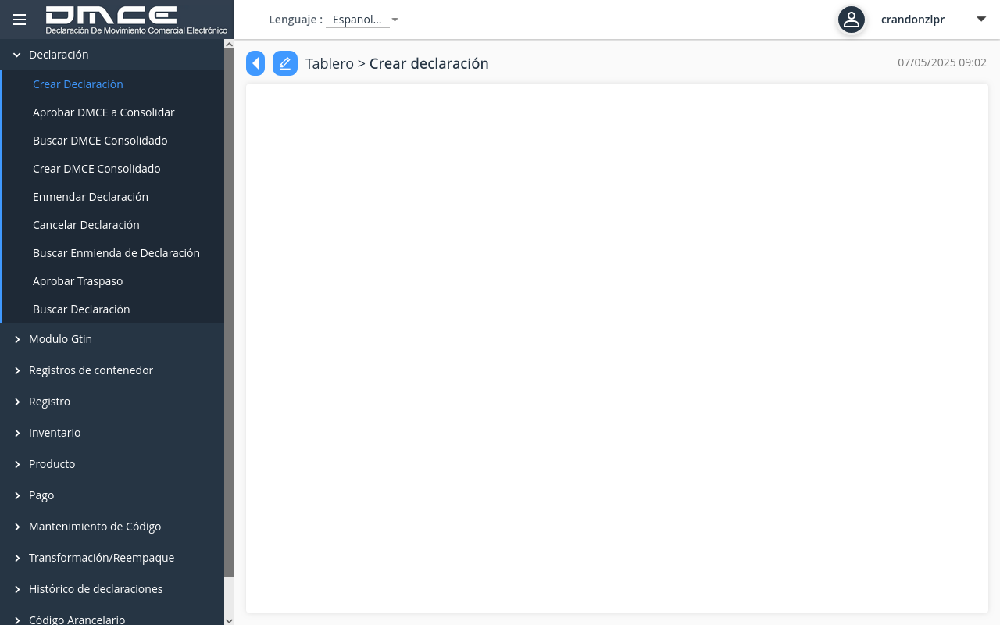

# DMCE Portal Automation Evidence Report

## Overview
This report documents the execution of the DMCE portal automation script, including screenshots of each step in the process and details about any issues encountered.

## Execution Summary
- **Script**: dmce_full_process_automation.js
- **Execution Time**: May 7, 2025
- **Status**: Partial Success - Login successful, dashboard loading timeout

## Process Steps and Screenshots

### 1. Initial Login Page


### 2. Login Popup


### 3. Post-Login Dashboard


### 4. Dashboard Loading (Timeout Error)


## Error Analysis
The script successfully:
- Navigated to the DMCE login page
- Opened the login popup
- Extracted hidden form fields
- Submitted credentials
- Authenticated successfully

However, it encountered a timeout error while waiting for the dashboard to fully load. The specific error was:

```
Error during automation: page.waitForFunction: Timeout 30000ms exceeded.
at /home/ubuntu/repos/Cortana/dmce_full_process_automation.js:163:17
```

The script was waiting for the dashboard page to be fully loaded and visible, but this condition was not met within the 30-second timeout period.

## Recommendations
1. Increase the dashboard loading timeout (currently 30 seconds)
2. Modify the dashboard detection logic to be more flexible
3. Implement a retry mechanism for dashboard loading
4. Consider alternative navigation approaches after login

## Evidence Files
- **Screenshots**: All captured in the `screenshots` directory
- **Trace**: Full Playwright trace available in `trace.zip`
- **Logs**: Console output showing request/response details

## Next Steps
The script needs to be updated to better handle the dashboard loading phase. Once this issue is resolved, the full declaration process can be tested.
